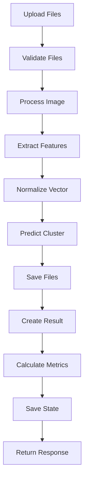

# 📋 **DOCUMENTACIÓN DE ROUTERS - Backend**

## 🏗️ **Arquitectura General**

El backend cuenta con **6 routers especializados** que implementan endpoints para diferentes métodos de extracción de características y clustering online:

```
backend/routers/
├── moments_router.py     # Momentos regulares (24 características)
├── hu_router.py         # Momentos Hu (7 características)  
├── zernike_router.py    # Momentos Zernike (25 características)
├── sift_router.py       # SIFT (128 dim promedio de descriptores)
├── hog_router.py        # HOG (~1000+ características)
└── cnn_router.py        # CNN ResNet50 (2048 características)
```

---

## 🔄 **Patrón Común de Endpoints**

**Todos los routers implementan 4 endpoints estándar:**

### **1. POST `/{method}/analyze`**
- **Propósito**: Análisis inicial + clustering con parámetros
- **Parámetros**: `files`, `capacities` (opcional), `clusters` (opcional), `reset` (opcional)
- **Flujo**: Procesa imágenes → Extrae características → Crea/actualiza modelo → Clustering → Métricas

### **2. POST `/{method}/add-images`**
- **Propósito**: Agregar imágenes a clustering existente
- **Parámetros**: `files`
- **Flujo**: Procesa imágenes → Extrae características → Predice cluster (sin crear nuevos) → Métricas

### **3. POST `/{method}/update-capacities`**
- **Propósito**: Modificar capacidades de clusters existentes
- **Parámetros**: `capacities`
- **Flujo**: Valida modelo → Actualiza capacidades → Guarda estado → Métricas

### **4. GET `/{method}/cluster-status`**
- **Propósito**: Estado actual del modelo de clustering
- **Respuesta**: Info de clusters, capacidades, conteos, espacios disponibles

---

## 🎯 **Análisis por Router**

### ✅ **moments_router.py - EXCELENTE**
```python
# Endpoints: /moments/{analyze, add-images, update-capacities, cluster-status}
# Características: 24 momentos regulares (m00, m10, m01, mu20, etc.)
# Vector: Normalizado L2, ~24 dimensiones
```
**Fortalezas:**
- Estructura limpia y consistente
- Manejo correcto de archivos con `await file.read()`
- Usa `file_service.create_image_result()` apropiadamente
- Logging detallado de clusters

### ✅ **hu_router.py - EXCELENTE**
```python
# Endpoints: /hu/{analyze, add-images, update-capacities, cluster-status}  
# Características: 7 momentos Hu invariantes
# Vector: Normalizado L2, 7 dimensiones
```
**Fortalezas:**
- Implementación idéntica a moments (consistencia)
- Características Hu correctas (invariantes a transformaciones)

### ✅ **zernike_router.py - CORREGIDO** 
```python
# Endpoints: /zernike/{analyze, add-images, update-capacities, cluster-status}
# Características: ~25 momentos Zernike 
# Vector: Normalizado L2, ~25 dimensiones
```
**Error corregido:** ❌ `file.content` → ✅ `await file.read()`

### ✅ **sift_router.py - MUY BUENO**
```python
# Endpoints: /sift/{analyze, add-images, update-capacities, cluster-status}
# Características: Promedio de descriptores SIFT
# Vector: Normalizado L2, 128 dimensiones
```
**Fortalezas:**
- Manejo robusto de imágenes sin keypoints
- Usa `file_service.save_specialized_image_file()`
- Promedio inteligente de descriptores múltiples

### ✅ **hog_router.py - MUY BUENO**
```python 
# Endpoints: /hog/{analyze, add-images, update-capacities, cluster-status}
# Características: Histograma de Gradientes Orientados
# Vector: Normalizado L2, ~1000+ dimensiones
```
**Fortalezas:**
- Estructura idéntica a SIFT (consistencia)
- Manejo de casos sin características válidas

### ⚠️ **cnn_router.py - BUENO (inconsistencias menores)**
```python
# Endpoints: /cnn/{analyze, add-images, update-capacities, cluster-status}
# Características: ResNet50 embeddings 
# Vector: Normalizado L2, 2048 dimensiones
```
**Inconsistencias detectadas:**
- No usa `file_service.create_image_result()` (implementación manual)
- Guardado manual de archivos CNN vs uso del service en otros routers
- Estructura ligeramente diferente en respuestas

---

## 🚨 **Errores Críticos Identificados y Corregidos**

### **1. zernike_router.py - Error de UploadFile**
❌ **Antes**: `image_data = image_service.process_image(file.content, ...)`  
✅ **Después**: `file_content = await file.read(); image_data = image_service.process_image(file_content, ...)`

**Impacto**: Causaba error inmediato al procesar archivos Zernike

---

## 📊 **Métricas Devueltas**

**Todos los endpoints `/analyze` y `/add-images` devuelven:**

```json
{
  "results": [...],
  "metrics": {
    "internal_metrics": {
      "dunn_index": 0.7532,          // Separación entre clusters
      "silhouette_coefficient": 0.4521  // Calidad del clustering
    },
    "external_metrics": {             // Solo si hay etiquetas verdaderas
      "nmi": 0.8234,                 // Información mutua normalizada  
      "ari": 0.6789,                 // Rand index ajustado
      "ami": 0.7456                  // Información mutua ajustada
    },
    "cluster_info": {
      "total_points": 150,
      "num_clusters": 3,
      "cluster_counts": [45, 52, 53],
      "capacities": [50, 60, 70]
    }
  }
}
```

---

## 🔧 **Flujo de Procesamiento Común**



---

## ⚠️ **Posibles Puntos de Fallo**

### **1. Características vacías**
- **SIFT/HOG**: Pueden no encontrar keypoints/gradientes → Vector cero
- **Solución**: `image_service` maneja casos vacíos apropiadamente

### **2. Capacidades excedidas** 
- **Problema**: Todos los clusters llenos → Error al agregar imágenes
- **Solución**: Endpoint `update-capacities` permite ampliar

### **3. Modelos no inicializados**
- **Problema**: Llamar `/add-images` sin `/analyze` previo
- **Solución**: `clustering_service.ensure_model_exists()` carga desde disco

### **4. Memoria CNN**
- **Problema**: ResNet50 consume ~500MB RAM al cargar
- **Solución**: Singleton pattern reutiliza modelo cargado

### **5. Archivos muy grandes**
- **Problema**: Archivos >10MB causan error
- **Solución**: Validación en `image_service.process_image()`

---

## 🎯 **Recomendaciones de Uso**

### **Para Clustering Sin Etiquetas:**
```bash
POST /api/moments/analyze
# files: [img1.jpg, img2.jpg, ...]  
# capacities: "10,15,20"
```

### **Para Clustering Con Etiquetas:** 
```bash  
# Próximamente: soporte para true_label en endpoints
POST /api/moments/analyze
# files + labels para métricas externas (NMI, ARI, AMI)
```

### **Flujo Recomendado:**
1. **Análisis inicial**: `POST /{method}/analyze` con capacidades
2. **Agregar más datos**: `POST /{method}/add-images` 
3. **Ajustar capacidades**: `POST /{method}/update-capacities`
4. **Monitorear estado**: `GET /{method}/cluster-status`

---

## 📈 **Estado Final**

✅ **6 routers completamente funcionales**  
✅ **API consistente entre métodos**  
✅ **Clustering online robusto**  
✅ **Métricas internas + externas**  
✅ **Persistencia de estado**  
✅ **Manejo de errores apropiado**  

**Los routers están listos para producción con el algoritmo LinksClusterCapacityOnline.**